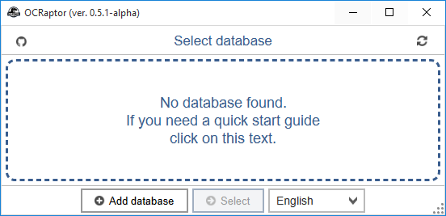
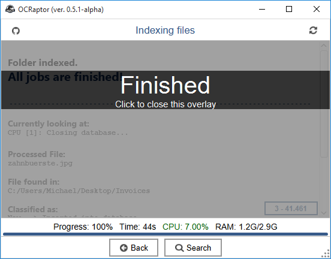
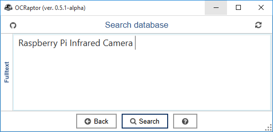

OCRaptor
====

**OCRaptor** allows you to create a **full-text index** of your document files in a specified folder.
You can search that index rather than running a full-text search of each individul document file in your catalog.
An index search produces a results list with links to the occurrences of the indexed documents.

The main focus of this application lies on [optical character recognition (OCR)](http://en.wikipedia.org/wiki/Optical_character_recognition).
It extracts text from your (embedded/standalone) image files and stores them in a **searchable and portable database**.
In addition, OCRaptor also stores plain text and metadata of your documents.

The application supports a [wide variety of document filetypes](#SupportedFiletypes)

<!---

# Outline

[TOC]
-->

# System requirements
* **Microsoft Windows** 7/8 x64
* **Linux** x64
* **Apple** OSX 10.8-10.10

OCRaptor requires at least 2048 MB of RAM.

Due to time constraints, 32Bit-Systems are not supported. 
OCRaptor comes with a **build-in Java 8** Runtime Environment.

# Supported filetypes
* **Image files**
    * JPEG, PNG, TIFF, BMP, GIF
* **Microsoft Office**
    * Word, Excel, Powerpoint,
        [XPS](http://windows.microsoft.com/en-us/windows7/products/features/xps),
        [RTF](http://en.wikipedia.org/wiki/Rich_Text_Format),
        [CHM](http://en.wikipedia.org/wiki/Microsoft_Compiled_HTML_Help)
* **LibreOffice / OpenOffice**
    * Writer, Impress, Calc
* **Apple iWork'09**
    * Pages, Numbers, Key
* Adobe PDF
* [Postscript](http://en.wikipedia.org/wiki/PostScript)
* XML, HTML
* [EPUB](http://en.wikipedia.org/wiki/EPUB)
* [Xournal](http://en.wikipedia.org/wiki/Xournal)
* Plain textfiles  
* **Planned filetypes**
    * Apple iWork'13
    * Archives-files (*.zip, *.rar...)
    * [DjVu](http://en.wikipedia.org/wiki/DjVu)
    * Microsoft Publisher
    * Microsoft OneNote
    * [Evernote](https://evernote.com/intl/de/)
    * [RSS-Feeds](http://en.wikipedia.org/wiki/RSS)

If you need **sample image scans** to test OCRaptor, [here](https://mega.co.nz/#!6EhgTSRT!E-ImSkcKu5CTJTme2P8DfcJOLrQ7H2GnYMyt60LjVNs) are the files used in my test cases. 
The 7zip-archive contains photos and scanned images of documents in English and German.

# Download and Installation
**BE AWARE THAT OCRAPTOR IS A WORK IN PROGRESS AND THEREFORE CONTAINS A VARIETY OF BUGS AND ROUGH EDGES. I STRONGLY ADVISE YOU NOT TO USE
THIS APPLICATION IN A PRODUTIVE ENVIRONMENT.**

* **Microsoft Windows** 
  The installation on Windows is a straightforward process, requiring minimum user input. Just download the application from
  [mirror 1](https://mega.co.nz/#!TUQzASLI!lLP0YTdDUrOzPe_oNVHFw4teqsKbR5uvv4G6I7RuH8g)
  or [mirror 2](http://workupload.com/file/b2OmCVjr)
  and follow the steps of the installer (there are no hidden adware options.)

  Version: 0.7.1 (06.12.2014)
  Date: 2014-12-06 17:35 
  Size: 129 MB 
  Md5sum: 6e87ad801ca42e96d1fc64b693d2f94e 

* **Linux** 
  At the moment there is no Linux installer available. Just download the 7zip-archive from
  [mirror 1](https://mega.co.nz/#!WYBxQZSR!ISlEoRngJpu0G03aa8-BJx5U_cN5CkjWDC4NLv_AkTU)
  or [mirror 2](http://workupload.com/file/FUfv0iLv) and extract it to your desired location.

  Version: 0.7.1 (06.12.2014)
  Date: 2014-12-07 00:12 
  Size: 107.21 
  Md5sum: ff42549941a59101c7b4457e30656210 

* **Apple OSX** 
  At the moment there is no OSX installer available. Just download the 7zip-archive from
  [mirror 1](https://mega.co.nz/#!aNQ0zJ5C!fB2FsoRGc3o9tW24ZRmXQHuH28l4044roWyWe38PUKI)
  or [mirror 2](http://workupload.com/file/jHwZVsO1) and extract it to your desired location.

  Version: 0.7.1 (06.12.2014)
  Date: 2014-12-07 00:12 
  Size: 99.13 
  Md5sum: ff42549941a59101c7b4457e30656210 

* ~~**Cross-platform version**~~ (Not ready yet)

# Starting
* **Microsoft Windows** 
    Just double click the newly created desktop icon and the application should start.
  

* **Linux** 

  Go to the extracted folder: 
  ``cd OCRaptor-0.7.1-Linux`` 

  Before starting OCRaptor you should assign some execute permissions: 
  ``chmod u+x OCRaptor*`` 

  Then execute the main shell sript: 
  ``./OCRaptor``

* **Apple OSX** 

  Go to the extracted folder: 
  ``cd OCRaptor-0.7.1-Osx`` 

  Before starting OCRaptor you should assign some execute permissions: 
  ``chmod u+x OCRaptor*`` 

  Then execute the main shell sript: 
  ``./OCRaptor``

# Interface

## Quick Guide

First of all, you need to add a new document database. Click on '**Add database**'.

Select an empty folder and name it.

## Adding a new Database

TODO :: TODO :: TODO :: TODO :: TODO :: TODO

## Editing your Database

TODO :: TODO :: TODO :: TODO :: TODO :: TODO

## Searching your Database

TODO :: TODO :: TODO :: TODO :: TODO :: TODO

## Search Result Screen

TODO :: TODO :: TODO :: TODO :: TODO :: TODO

## Settings Manager

TODO :: TODO :: TODO :: TODO :: TODO :: TODO

### Option: 'Enable optical character recognition (OCR)'

TODO :: TODO :: TODO :: TODO :: TODO :: TODO

### Option: 'Include Metadata'

TODO :: TODO :: TODO :: TODO :: TODO :: TODO

### Option: 'Include standalone image files'

TODO :: TODO :: TODO :: TODO :: TODO :: TODO

### Option: 'Include text files'

TODO :: TODO :: TODO :: TODO :: TODO :: TODO

### Option: 'Preprocess images for OCR'

TODO :: TODO :: TODO :: TODO :: TODO :: TODO

### Option: 'Only show new files while indexing'

TODO :: TODO :: TODO :: TODO :: TODO :: TODO

### Option: 'OCR Language'

TODO :: TODO :: TODO :: TODO :: TODO :: TODO

### Option: 'Enable bug report screens'

TODO :: TODO :: TODO :: TODO :: TODO :: TODO

### Option: 'Pause indexing on error'

TODO :: TODO :: TODO :: TODO :: TODO :: TODO

### Option: 'Enable app command stderr output'

TODO :: TODO :: TODO :: TODO :: TODO :: TODO

### Option: 'Always remove missing files from database'

TODO :: TODO :: TODO :: TODO :: TODO :: TODO

### Option: 'Max search results to show'

TODO :: TODO :: TODO :: TODO :: TODO :: TODO

### Option: 'Number of CPU-Cores to use'

TODO :: TODO :: TODO :: TODO :: TODO :: TODO

### Option: 'Passwords'

TODO :: TODO :: TODO :: TODO :: TODO :: TODO

### Option: 'Text file extensions'

TODO :: TODO :: TODO :: TODO :: TODO :: TODO

### Option: Image properties

TODO :: TODO :: TODO :: TODO :: TODO :: TODO

### Option: 'Bash/Shell commands'

TODO :: TODO :: TODO :: TODO :: TODO :: TODO

# Command Line Version

TODO :: TODO :: TODO :: TODO :: TODO :: TODO

## Options

    **************************************************************************
    usage: indexer.jar -d <DIR> [-c <FILE>] [-i <DIR>] [-l <STRING>]
            [-p] [-q] [-r] [-s] [-v] [-g] [-h] [-H]
    **************************************************************************
     -d,--db-directory <DIR>   Path to your database directory [REQUIRED]
     -c,--config-file <FILE>   Path to your configuration file.
     -i,--index <DIR>          Path to the directory you want to index
     -l,--locate <STRING>      Search database for given string
     -p,--progress             Count files and show a progress-bar (takes
                               longer).
     -q,--quiet                Suppress any output.
     -r,--reset-db             Reset given database
     -s,--show-dialog          Show open-file dialog
     -v,--verbose              Show more progress-information
     -g,--gui                  Show GUI-Version.
     -h,--help                 Shows this infopage.
     -H,--extended-help        Shows a detailed infopage.
    **************************************************************************

# FAQ
## OCR

TODO :: TODO :: TODO :: TODO :: TODO :: TODO

## Indexing

The technology behind OCRaptor is called indexing. When you install the application...

TODO :: TODO :: TODO :: TODO :: TODO :: TODO

# Release Notes

TODO :: TODO :: TODO :: TODO :: TODO :: TODO :: TODO

# Requested/Planed features

TODO :: TODO :: TODO :: TODO :: TODO :: TODO :: TODO

# Privacy Policy

TODO :: TODO :: TODO :: TODO :: TODO :: TODO :: TODO

# Contact me
    Name:   Michael Jedich
    E-mail: m.jedich@mail.de
    GitHub: https://github.com/kolbasa

<!---

    .
    .
    .
    .
    .
    .
    .
    .
    .
    .
    .
    .
    .
    .
    .
    .
    .
    .
    .
    .
    .
    .

-->
