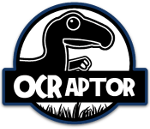
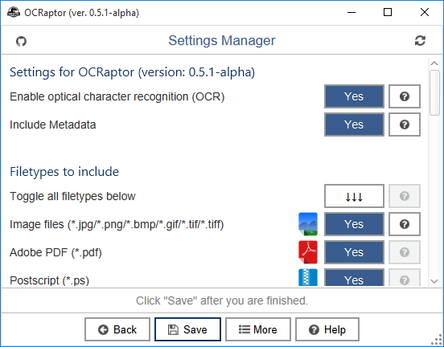
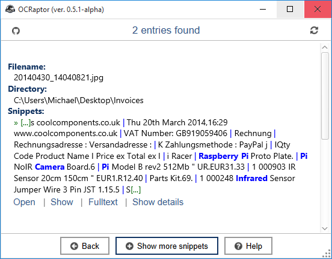
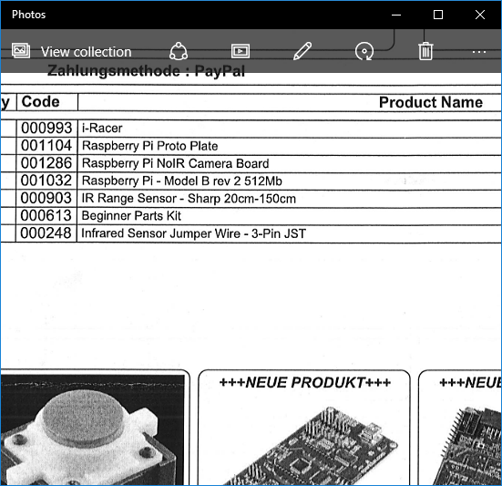

OCRaptor
====

**OCRaptor** allows you to create a **full-text index** of your document files in a specified folder.
You can search that index rather than running a full-text search of each individual document file in your catalog.
An index search produces a results list with links to the occurrences of the indexed documents.

The main focus of this application lies on [optical character recognition (OCR)](http://en.wikipedia.org/wiki/Optical_character_recognition).
It extracts text from your (embedded/standalone) image files and stores them in a **searchable and portable database**.
In addition, OCRaptor also stores plain text and metadata of your documents.

The application supports a [wide variety of document filetypes](#SupportedFiletypes), so you don't have to convert your files to one required format.

# System requirements
* **Microsoft Windows** 7/8 x64
* **Linux** x64
* **Apple OSX** 10.8-10.10

OCRaptor comes with a **build-in Java 8** Runtime Environment. Make
sure that your system has at least 2048 MB of RAM.

# Supported filetypes
* **Image files**
    * JPEG, PNG, TIFF, BMP, GIF
* **Microsoft Office**
    * Word, Excel, Powerpoint,
        [XPS](http://windows.microsoft.com/en-us/windows7/products/features/xps),
        [RTF](http://en.wikipedia.org/wiki/Rich_Text_Format),
* **LibreOffice / OpenOffice**
    * Writer, Impress, Calc
* **Apple iWork'09**
    * Pages, Numbers, Key
* Adobe PDF
* [Postscript](http://en.wikipedia.org/wiki/PostScript)
* XML, HTML
* [EPUB](http://en.wikipedia.org/wiki/EPUB)
* [Xournal](http://en.wikipedia.org/wiki/Xournal)
* Plain textfiles  
* **Planned filetypes**
    * Apple iWork'13
    * Archives-files (*.zip, *.rar...)
    * [DjVu](http://en.wikipedia.org/wiki/DjVu)
    * Microsoft Publisher
    * Microsoft OneNote

If you need **sample image scans** to test OCRaptor,
[here](https://github.com/kolbasa/OCRaptor/releases/download/v.0.5.1-alpha/OCRaptor-Testdocuments.7z)
are the files used in my test cases. 
The 7zip-archive contains photos and scanned images of documents in English and German.

# Download and Installation
**Be aware that OCRaptor is a work in progress and therefore contains a variety of bugs and rough edges. I strongly advise you not to use
this application in a produtive environment.**

* **Microsoft Windows** 
  The installation on Windows is a straightforward process, requiring minimum user input. Just download the application from
  [here](https://github.com/kolbasa/OCRaptor/releases/tag/v.0.5.1-alpha) and follow the steps of the installer (there are no hidden adware options).

* **Linux** 
  At the moment there is no Linux installer available. Just download the 7zip-archive from
  [here](https://github.com/kolbasa/OCRaptor/releases/tag/v.0.5.1-alpha), extract it to your desired location and install the dependencies
  as shown below.

  There are some packages that are required to run OCRaptor in Linux: 
  ``tesseract-ocr``, ``libtesseract3``, ``liblept4``, ``ghostscript``

  Shell command for distributions based on **Debian**: 
  ``sudo apt-get install tesseract-ocr libtesseract3 liblept4 ghostscript``

  Shell command for **Arch Linux**: 
  ``sudo pacman -S tesseract leptonica ghostscript``

  Shell command for the **RPM-based** distributions: 
  ``TODO: will look into it soon``

* **Apple OSX** 
  The OSX package **has not been thoroughly tested**, but it should work - theoretically.

  Just download the 7zip-archive from [here](https://github.com/kolbasa/OCRaptor/releases/tag/v.0.5.1-alpha), extract it to your desired location
  and install ``tesseract`` and ``ghostscript`` via [``brew``](http://brew.sh/).

  If you encounter problems running OCRaptor on a Mac, please let me
  [know](https://github.com/kolbasa/OCRaptor/issues).

# Starting
* **Microsoft Windows** 
    Just double click the newly created desktop icon and the application should start.
  

* **Linux** 

  Go to the extracted folder: 
  ``cd OCRaptor-Linux`` 

  Before starting OCRaptor you should assign some execute permissions: 
  ``chmod u+x ocraptor ocraptor-cl ocraptor-pl`` 

  Then execute the main shell script: 
  ``./ocraptor``

* **Apple OSX** 

  Go to the extracted folder: 
  ``cd OCRaptor-Osx`` 

  Before starting OCRaptor you should assign some execute permissions: 
  ``chmod u+x ocraptor ocraptor-cl ocraptor-pl`` 

  Then execute the main shell sript: 
  ``./ocraptor``

# Interface

## Quick Guide

When you first open OCRaptor, you will see this screen.
To get started you need to add a new document database. Click on '**Add database**'.
  

Select an empty folder and name it, then click '**Save**'. You will
return to the previous screen with a new entry.
  

In this scenario there are two databases: 'Incoming Invoices' and 'Study Documents'.
Simply mark your entry and click '**Select**' to load the database.
  

Now you have to select the directories you want to index. You can simply
drag them into the window or select them by clicking '**Add Folder**'.
  

They should now appear in the list.
  

In the '*Settings Manager*' window ('**Config**' button) you can configure
which filetypes you want to include (e.g. Adobe PDF, Microsoft Office).
  

Now click the '**Index**' button to populate your file database. This step
may take awhile, depending on size and number of files in your document
folder. Text extraction from image files can be highly CPU-intensive.
However, you only have to do it once, after that you have a full
index of your scanned documents. If you add or modify files, then just repeat
this step and OCRaptor will automatically update its index while
skipping unchanged files.
  

Depending on your system's configuration, a firewall may request your
permission to allow access to public networks. Click cancel and
block all requests. **OCRaptor does not try to connect to extern
servers**. However, it does use a server-client model for processing document
files. This implementation is restricted to the local network. You can
change the default port (1098) in the Settings Manager.
  

Now you can search your document database. Click **Search**.
  

Enter your search query.
  

A simple search for a scanned invoice of a Raspberry Pi Infrared
Camera. OCRaptor supports Boolean Operators, Wildcard Searches,
Fuzzy Searches and Proximity Searches. I will update the documentation
soon on this topic.
  

The search result. If you click '**Open**' your file will open in your default image viewer
application. '**Show**' will mark the file in your default file browser.
'**Fulltext**' will show you the complete text in your default web
browser (;
  

The picture below shows the standard Windows 10 Photo
Viewer.
  

# Command Line Version

OCRaptor has a fully functional commandline interface.

## Options

    **************************************************************************
    usage: ocraptor-cl -d <DIR> [-c <FILE>] [-f <STRING>] [-i <DIR>] [-b] [-g]
           [-h] [-H] [-p] [-q] [-r] [-s] [-u] [-v]

    options:
     -d,--db-directory <DIR>   Path to your database directory [REQUIRED]
     -c,--config-file <FILE>   Path to your configuration file.
     -f,--find <STRING>        Search database for given string
     -i,--index <DIR>          Path to the directory you want to index
     -b,--build-in-jre         Use build-in JRE.
     -g,--gui                  Show GUI-Version.
     -h,--help                 Shows this infopage.
     -H,--extended-help        Shows a detailed infopage.
     -p,--progress             Count files and show a progress-bar (takes
                               longer).
     -q,--quiet                Suppress any output.
     -r,--reset-db             Reset given database
     -s,--show-dialog          Show open-file dialog
     -u,--userfolder           Copy config-files to user-folder.
     -v,--verbose              Show more progress-information
    **************************************************************************

## Adding a new Database

TODO :: TODO :: TODO :: TODO :: TODO :: TODO

## Editing your Database

TODO :: TODO :: TODO :: TODO :: TODO :: TODO

## Searching your Database

TODO :: TODO :: TODO :: TODO :: TODO :: TODO

## Search Result Screen

TODO :: TODO :: TODO :: TODO :: TODO :: TODO

## Settings Manager

TODO :: TODO :: TODO :: TODO :: TODO :: TODO

### Option: 'Enable optical character recognition (OCR)'

TODO :: TODO :: TODO :: TODO :: TODO :: TODO

### Option: 'Include Metadata'

TODO :: TODO :: TODO :: TODO :: TODO :: TODO

### Option: 'Include standalone image files'

TODO :: TODO :: TODO :: TODO :: TODO :: TODO

### Option: 'Include text files'

TODO :: TODO :: TODO :: TODO :: TODO :: TODO

### Option: 'Preprocess images for OCR'

TODO :: TODO :: TODO :: TODO :: TODO :: TODO

### Option: 'Only show new files while indexing'

TODO :: TODO :: TODO :: TODO :: TODO :: TODO

### Option: 'OCR Language'

TODO :: TODO :: TODO :: TODO :: TODO :: TODO

### Option: 'Enable bug report screens'

TODO :: TODO :: TODO :: TODO :: TODO :: TODO

### Option: 'Pause indexing on error'

TODO :: TODO :: TODO :: TODO :: TODO :: TODO

### Option: 'Enable app command stderr output'

TODO :: TODO :: TODO :: TODO :: TODO :: TODO

### Option: 'Always remove missing files from database'

TODO :: TODO :: TODO :: TODO :: TODO :: TODO

### Option: 'Max search results to show'

TODO :: TODO :: TODO :: TODO :: TODO :: TODO

### Option: 'Number of CPU-Cores to use'

TODO :: TODO :: TODO :: TODO :: TODO :: TODO

### Option: 'Text file extensions'

TODO :: TODO :: TODO :: TODO :: TODO :: TODO

### Option: Image properties

TODO :: TODO :: TODO :: TODO :: TODO :: TODO

### Option: 'Bash/Shell commands'

TODO :: TODO :: TODO :: TODO :: TODO :: TODO

# Build from source

TODO :: TODO :: TODO :: TODO :: TODO :: TODO

# FAQ
## OCR

TODO :: TODO :: TODO :: TODO :: TODO :: TODO

## Indexing

The technology behind OCRaptor is called indexing. When you install the application...

TODO :: TODO :: TODO :: TODO :: TODO :: TODO

# Release Notes

TODO :: TODO :: TODO :: TODO :: TODO :: TODO :: TODO

# Requested/Planed features

TODO :: TODO :: TODO :: TODO :: TODO :: TODO :: TODO

# Privacy Policy

TODO :: TODO :: TODO :: TODO :: TODO :: TODO :: TODO

# Contact me
    Name:   Michael Jedich
    E-mail: m.jedich@mail.de
    GitHub: https://github.com/kolbasa

<!---

    .
    .
    .
    .
    .
    .
    .
    .
    .
    .
    .
    .
    .
    .
    .
    .
    .
    .
    .
    .
    .
    .

-->
